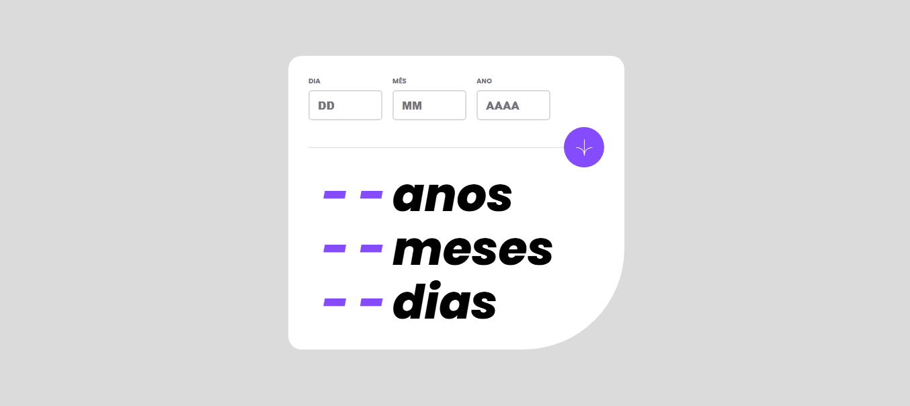
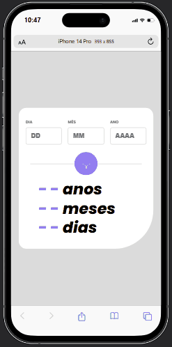

# Calculador de Idade

Mais um projeto tirado do Frontend Mentor para praticar o uso de datas no JS.

## Tecnologias usadas 👨‍💻

- HTML 

- CSS 

- JavaScript 

- TypeScript 

## Prévia Desktop 💻



## Prévia Mobile 📱



#### <a target="_blank" href="https://projeto-calculador-de-idade.vercel.app/">Clique aqui</a> para testar o projeto.

## Funcionalidades da aplicação 💡

Essa aplicação faz cálculos com a sua data de nascimento para determinar dias, meses e anos que você viveu até agora. Dentro desse projeto também existem verificações que te impedem de usar datas inválidas ou campos vazios.

## O que aprendi 🤔

O foco desse projeto foi colocar em prática e aprender mais sobre as manipulações de datas no JS, os cálculos usados no projeto precisavam dessa manipulação de datas, por isso tive que aprender mais e sobre isso.

## Passo a passo para clonar o projeto 📝

Para clonar o projeto, você pode usar o terminal de sua preferência. o passo a passo a seguir usa os comandos do gitbash como exemplo.

1 - Abra um terminal onde deseja colocar o projeto

2 - Clone o projeto
```
git clone "url do projeto"
```
3 - Acesse a pasta do projeto
```
cd projeto-calculador-de-idade
```
4 - Instale as dependências do projeto
```
npm install
```
5 - Compile os arquivos TypeScript
```
npx tsc
``` 
ou
```
tsc
```
6 - Abra no vscode
```
code .
```
7 - Execute o projeto usando o Live server